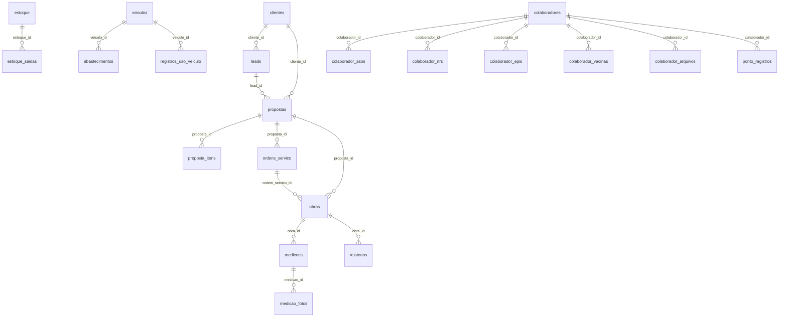

# HC GeoGestão — Banco de Dados (Schema Completo)

> Fonte de verdade: `src/integrations/supabase/types.ts` (1726 linhas, gerado automaticamente pelo Supabase)

## Resumo do Schema

| Nº | Tabela | Linhas de tipo | Descrição | FK (filho → pai) |
|---|---|---|---|---|
| 1 | `leads` | 820–883 | Leads do CRM | `leads.cliente_id → clientes.id` |
| 2 | `clientes` | 73–123 | Cadastro de clientes PF/PJ | — |
| 3 | `propostas` | 1264–1391 | Propostas técnicas | `propostas.cliente_id → clientes.id`, `propostas.lead_id → leads.id` |
| 4 | `proposta_itens` | 1211–1262 | Itens de cada proposta | `proposta_itens.proposta_id → propostas.id` |
| 5 | `ordens_servico` | 1090–1159 | Ordens de serviço | `ordens_servico.proposta_id → propostas.id` |
| 6 | `obras` | 997–1088 | Obras de campo | `obras.proposta_id → propostas.id`, `obras.ordem_servico_id → ordens_servico.id` |
| 7 | `medicoes` | 923–995 | Medições geotécnicas | `medicoes.obra_id → obras.id` |
| 8 | `medicao_fotos` | 885–921 | Fotos de medições | `medicao_fotos.medicao_id → medicoes.id` |
| 9 | `relatorios` | 1446–1515 | Relatórios técnicos | `relatorios.obra_id → obras.id` |
| 10 | `estoque` | 674–714 | Inventário de materiais/equipamentos | — |
| 11 | `estoque_saidas` | 716–767 | Saídas do estoque | `estoque_saidas.estoque_id → estoque.id` |
| 12 | `fornecedores` | 769–818 | Fornecedores | — |
| 13 | `veiculos` | 1517–1581 | Frota de veículos | — |
| 14 | `abastecimentos` | 17–71 | Abastecimentos de veículos | `abastecimentos.veiculo_id → veiculos.id` |
| 15 | `registros_uso_veiculo` | 1393–1444 | Registros de uso de veículos | `registros_uso_veiculo.veiculo_id → veiculos.id` |
| 16 | `colaboradores` | 386–450 | Funcionários | — |
| 17 | `colaborador_asos` | 165–219 | ASOs (Atestados de Saúde) | `colaborador_asos.colaborador_id → colaboradores.id` |
| 18 | `colaborador_nrs` | 277–331 | NRs (Normas Regulamentadoras) | `colaborador_nrs.colaborador_id → colaboradores.id` |
| 19 | `colaborador_epis` | 221–275 | EPIs (Equipamentos de proteção) | `colaborador_epis.colaborador_id → colaboradores.id` |
| 20 | `colaborador_vacinas` | 333–384 | Vacinas | `colaborador_vacinas.colaborador_id → colaboradores.id` |
| 21 | `colaborador_arquivos` | 124–163 | Arquivos gerais do colaborador | `colaborador_arquivos.colaborador_id → colaboradores.id` |
| 22 | `ponto_registros` | 1161–1209 | Registros de ponto | `ponto_registros.colaborador_id → colaboradores.id` |
| 23 | `contas_pagar` | 452–531 | Contas a pagar | — |
| 24 | `contas_receber` | 533–591 | Contas a receber | — |
| 25 | `despesas_fixas` | 593–630 | Despesas fixas mensais | — |
| 26 | `documentos_empresa` | 632–672 | Documentos da empresa | — |

**Total: 26 tabelas**

---

## Diagrama de Relacionamentos (ER simplificado)

---

## Detalhamento por Tabela

### Convenções Globais
- **`id`**: `UUID` (gen_random_uuid()), PK
- **`user_id`**: `UUID` NOT NULL — isolamento multi-tenant
- **`created_at`**: `TIMESTAMPTZ` (now())
- **`updated_at`**: `TIMESTAMPTZ` (now(), atualizado via trigger)
- **RLS**: Todas as tabelas com policies `auth.uid() = user_id` (SELECT, INSERT, UPDATE, DELETE)

---

### 1. `leads`
**Propósito**: Pipeline de vendas / CRM

| Coluna | Tipo | Req | Default | Descrição |
|---|---|---|---|---|
| `id` | uuid | ✅ | gen_random_uuid() | PK |
| `user_id` | uuid | ✅ | — | Dono do registro |
| `nome_contato` | text | ✅ | — | Nome do contato |
| `empresa` | text | ✅ | '' | Nome da empresa |
| `telefone_whatsapp` | text | — | '' | WhatsApp do contato |
| `email` | text | — | '' | Email |
| `cidade_uf` | text | — | '' | Cidade/UF |
| `status` | text | ✅ | 'Novo' | **Valores**: Novo, Qualificado, Portfólio Enviado, Reunião Agendada, Proposta Enviada, Negociação, Fechado (Ganho), Fechado (Perdido) |
| `tipo_servico_interesse` | text[] | — | '{}' | Array de serviços de interesse |
| `valor_estimado` | numeric | — | 0 | Valor estimado do deal |
| `prioridade` | text | ✅ | 'Média' | **Valores**: Alta, Média, Baixa |
| `proximo_contato_em` | date | — | — | Data do próximo follow-up |
| `observacoes` | text | — | '' | Notas livres |
| `cliente_id` | uuid | — | — | FK → `clientes.id` (ON DELETE SET NULL) |
| `created_at` | timestamptz | ✅ | now() | |
| `updated_at` | timestamptz | ✅ | now() | |

---

### 2. `clientes`
**Propósito**: Cadastro de clientes PF/PJ

| Coluna | Tipo | Req | Default | Descrição |
|---|---|---|---|---|
| `id` | uuid | ✅ | gen_random_uuid() | PK |
| `user_id` | uuid | ✅ | — | |
| `razao_social` | text | ✅ | — | Razão social ou nome |
| `nome_fantasia` | text | — | '' | Nome fantasia |
| `cnpj_cpf` | text | — | '' | CNPJ (14 dígitos) ou CPF (11 dígitos) |
| `tipo_cliente` | text | ✅ | 'Pessoa Jurídica' | **Valores**: Pessoa Física, Pessoa Jurídica |
| `contato_principal` | text | — | '' | Nome do contato |
| `telefone` | text | — | '' | |
| `email` | text | — | '' | |
| `endereco` | text | — | '' | |
| `cidade_uf` | text | — | '' | |
| `observacoes` | text | — | '' | |
| `created_at` | timestamptz | ✅ | now() | |
| `updated_at` | timestamptz | ✅ | now() | |

---

### 3. `propostas`
**Propósito**: Propostas técnicas comerciais

| Coluna | Tipo | Req | Default | Descrição |
|---|---|---|---|---|
| `id` | uuid | ✅ | gen_random_uuid() | PK |
| `user_id` | uuid | ✅ | — | |
| `numero` | text | ✅ | — | Número sequencial (gerado via RPC) |
| `revisao` | text | — | — | Ex: "R.00", "R.01" |
| `titulo` | text | ✅ | — | Título da proposta |
| `status` | text | ✅ | 'Rascunho' | **Valores**: Rascunho, Enviada, Em Análise, Aprovada, Reprovada, Cancelada |
| `tipo_servico` | text | ✅ | — | Tipo do serviço principal |
| `data_emissao` | date | ✅ | today | Data de emissão |
| `validade_dias` | integer | ✅ | 15 | Dias de validade |
| `valor_total` | numeric | ✅ | 0 | Valor total da proposta |
| `desconto_percentual` | numeric | ✅ | 0 | Desconto em % |
| `cliente_id` | uuid | — | — | FK → `clientes.id` |
| `lead_id` | uuid | — | — | FK → `leads.id` |
| `contratante_nome` | text | — | — | Nome do contratante |
| `cnpj_cpf` | text | — | — | Doc do contratante |
| `contato_nome` | text | — | — | Contato do contratante |
| `contato_telefone` | text | — | — | |
| `contato_email` | text | — | — | |
| `local_obra` | text | — | — | Local da obra |
| `forma_pagamento` | text | — | — | |
| `condicoes_pagamento` | text | — | — | |
| `prazo_inicio` | text | — | — | |
| `prazo_execucao_campo` | text | — | — | |
| `prazo_entrega_relatorio` | text | — | — | |
| `prazo_execucao` | text | — | — | |
| `encargos_contratante` | text | — | — | |
| `encargos_contratada` | text | — | — | |
| `condicoes_gerais` | text | — | — | |
| `cancelamento_suspensao` | text | — | — | |
| `notas_complementares` | text | — | — | |
| `observacoes` | text | — | — | |
| `arquivo_nome` | text | — | — | Nome do arquivo anexo |
| `arquivo_url` | text | — | — | URL no Storage |
| `created_at` | timestamptz | ✅ | now() | |
| `updated_at` | timestamptz | ✅ | now() | |

---

### 4. `proposta_itens`
**Propósito**: Itens individuais de uma proposta (tabela de preços)

| Coluna | Tipo | Req | Default | Descrição |
|---|---|---|---|---|
| `id` | uuid | ✅ | gen_random_uuid() | PK |
| `proposta_id` | uuid | ✅ | — | FK → `propostas.id` |
| `item_numero` | text | — | — | Ex: "1.1", "2.3" |
| `descricao` | text | ✅ | — | Descrição do item |
| `unidade` | text | ✅ | 'un' | Unidade de medida |
| `quantidade` | numeric | ✅ | 0 | |
| `valor_unitario` | numeric | ✅ | 0 | |
| `valor_total` | numeric | ✅ | 0 | |
| `ordem` | integer | ✅ | 0 | Ordem de exibição |
| `is_grupo` | boolean | — | false | Se é cabeçalho de grupo |
| `grupo_nome` | text | — | — | Nome do grupo |
| `created_at` | timestamptz | ✅ | now() | |

---

### 5. `ordens_servico`
**Propósito**: Ordens de serviço geradas a partir de propostas aprovadas

| Coluna | Tipo | Req | Default | Descrição |
|---|---|---|---|---|
| `id` | uuid | ✅ | gen_random_uuid() | PK |
| `user_id` | uuid | ✅ | — | |
| `numero` | text | ✅ | — | Número sequencial (gerado via RPC) |
| `proposta_id` | uuid | — | — | FK → `propostas.id` |
| `cliente_nome` | text | ✅ | '' | Nome do cliente |
| `local_obra` | text | — | '' | |
| `tipo_servico` | text | — | '' | |
| `descricao_servico` | text | — | — | |
| `responsavel` | text | — | — | |
| `equipe` | text | — | — | |
| `status` | text | ✅ | 'Aberta' | **Valores**: Aberta, Em Execução, Concluída, Cancelada |
| `data_emissao` | date | ✅ | today | |
| `data_inicio` | date | — | — | |
| `data_previsao_fim` | date | — | — | |
| `data_conclusao` | date | — | — | |
| `observacoes` | text | — | — | |
| `created_at` | timestamptz | ✅ | now() | |
| `updated_at` | timestamptz | ✅ | now() | |

---

### 6. `obras`
**Propósito**: Obras de campo com logística

| Coluna | Tipo | Req | Default | Descrição |
|---|---|---|---|---|
| `id` | uuid | ✅ | gen_random_uuid() | PK |
| `user_id` | uuid | ✅ | — | |
| `titulo` | text | ✅ | — | |
| `cliente_nome` | text | ✅ | '' | |
| `proposta_id` | uuid | — | — | FK → `propostas.id` |
| `ordem_servico_id` | uuid | — | — | FK → `ordens_servico.id` |
| `status` | text | ✅ | 'Planejada' | **Valores**: Planejada, Em Mobilização, Em Andamento, Pausada, Concluída, Cancelada |
| `progresso` | integer | ✅ | 0 | 0-100% |
| `tipo_servico` | text | — | — | |
| `local_obra` | text | — | — | |
| `responsavel` | text | — | — | |
| `equipe_campo` | text | — | — | Nomes da equipe |
| `data_inicio` | date | — | — | |
| `data_previsao_fim` | date | — | — | |
| `data_conclusao` | date | — | — | |
| `data_entrega_relatorio` | date | — | — | |
| `hotel` | text | — | — | Info de hospedagem |
| `alimentacao` | text | — | — | Info de alimentação |
| `transporte` | text | — | — | Info de transporte |
| `observacoes` | text | — | — | |
| `observacoes_logistica` | text | — | — | |
| `created_at` | timestamptz | ✅ | now() | |
| `updated_at` | timestamptz | ✅ | now() | |

---

### 7. `medicoes`
**Propósito**: Medições de campo (sondagem, profundidade, etc.)

| Coluna | Tipo | Req | Default | Descrição |
|---|---|---|---|---|
| `id` | uuid | ✅ | gen_random_uuid() | PK |
| `user_id` | uuid | ✅ | — | |
| `obra_id` | uuid | — | — | FK → `obras.id` |
| `titulo` | text | ✅ | — | |
| `data_registro` | date | ✅ | today | |
| `quantidade` | numeric | ✅ | 0 | |
| `unidade` | text | ✅ | 'un' | |
| `tipo_servico` | text | — | — | |
| `descricao_atividades` | text | — | — | |
| `profundidade_de` | numeric | — | — | Profundidade inicial (m) |
| `profundidade_ate` | numeric | — | — | Profundidade final (m) |
| `hora_inicio` | text | — | — | |
| `hora_fim` | text | — | — | |
| `clima` | text | — | — | |
| `coordenadas_gps` | text | — | — | |
| `ocorrencias` | text | — | — | |
| `observacoes` | text | — | — | |
| `created_at` | timestamptz | ✅ | now() | |
| `updated_at` | timestamptz | ✅ | now() | |

---

### 8. `medicao_fotos`
**Propósito**: Fotos anexas a medições

| Coluna | Tipo | Req | Default | Descrição |
|---|---|---|---|---|
| `id` | uuid | ✅ | PK | |
| `user_id` | uuid | ✅ | — | |
| `medicao_id` | uuid | ✅ | — | FK → `medicoes.id` |
| `nome_arquivo` | text | ✅ | '' | |
| `url` | text | ✅ | — | URL do Storage |
| `descricao` | text | — | — | |
| `created_at` | timestamptz | ✅ | now() | |

---

### 9. `relatorios`
**Propósito**: Relatórios técnicos

| Coluna | Tipo | Req | Default | Descrição |
|---|---|---|---|---|
| `id` | uuid | ✅ | PK | |
| `user_id` | uuid | ✅ | — | |
| `numero` | text | ✅ | '' | Sequencial (RPC) |
| `titulo` | text | ✅ | — | |
| `tipo` | text | ✅ | '' | Tipo de relatório |
| `obra_id` | uuid | — | — | FK → `obras.id` |
| `status` | text | ✅ | 'Em Elaboração' | **Valores**: Em Elaboração, Em Revisão, Aprovado, Entregue, Cancelado |
| `responsavel` | text | — | — | |
| `revisor` | text | — | — | |
| `versao` | text | — | — | Ex: "1.0" |
| `data_emissao` | date | ✅ | today | |
| `data_entrega` | date | — | — | |
| `descricao` | text | — | — | |
| `conclusoes` | text | — | — | |
| `recomendacoes` | text | — | — | |
| `observacoes` | text | — | — | |
| `created_at` | timestamptz | ✅ | now() | |
| `updated_at` | timestamptz | ✅ | now() | |

---

### 10. `estoque`
**Propósito**: Inventário de materiais e equipamentos

| Coluna | Tipo | Req | Default | Descrição |
|---|---|---|---|---|
| `id` | uuid | ✅ | PK | |
| `user_id` | uuid | ✅ | — | |
| `nome` | text | ✅ | — | |
| `categoria` | text | ✅ | '' | **Valores usados**: Sondagem à Percussão, Sondagem Rotativa, Instrumentação, Poços de Monitoramento, Poço Tubular Profundo, Material, Equipamentos, Geofísica, Escritório, Veículos, EPI, Outro |
| `quantidade` | numeric | ✅ | 0 | |
| `quantidade_minima` | numeric | ✅ | 0 | Alerta quando `quantidade <= quantidade_minima` |
| `unidade` | text | ✅ | 'un' | |
| `localizacao` | text | — | — | |
| `observacoes` | text | — | — | |
| `created_at` | timestamptz | ✅ | now() | |
| `updated_at` | timestamptz | ✅ | now() | |

---

### 11. `estoque_saidas`
**Propósito**: Saídas de material do estoque

| Coluna | Tipo | Req | Default | Descrição |
|---|---|---|---|---|
| `id` | uuid | ✅ | PK | |
| `user_id` | uuid | ✅ | — | |
| `estoque_id` | uuid | ✅ | — | FK → `estoque.id` |
| `quantidade` | numeric | ✅ | 0 | |
| `retirado_por` | text | ✅ | '' | Nome de quem retirou |
| `destino` | text | — | — | Obra ou local de destino |
| `tipo_saida` | text | ✅ | 'Consumo' | **Valores**: Consumo, Retornável |
| `data_saida` | date | ✅ | today | |
| `devolvido` | boolean | ✅ | false | Se o item foi devolvido |
| `data_devolucao` | date | — | — | |
| `observacoes` | text | — | — | |
| `created_at` | timestamptz | ✅ | now() | |

---

### 12. `fornecedores`

| Coluna | Tipo | Req | Default | Descrição |
|---|---|---|---|---|
| `id` | uuid | ✅ | PK | |
| `user_id` | uuid | ✅ | — | |
| `nome` | text | ✅ | — | |
| `tipo` | text | ✅ | '' | **Valores usados**: Material, Equipamento, Serviço, Escritório, Logística, Outro |
| `cnpj_cpf` | text | — | — | |
| `contato` | text | — | — | |
| `telefone` | text | — | — | |
| `email` | text | — | — | |
| `endereco` | text | — | — | |
| `cidade_uf` | text | — | — | |
| `produtos_servicos` | text | — | — | Descrição do que fornece |
| `observacoes` | text | — | — | |
| `created_at` | timestamptz | ✅ | now() | |
| `updated_at` | timestamptz | ✅ | now() | |

---

### 13. `veiculos`
**Propósito**: Frota de veículos da empresa

| Coluna | Tipo | Req | Default | Descrição |
|---|---|---|---|---|
| `id` | uuid | ✅ | PK | |
| `user_id` | uuid | ✅ | — | |
| `placa` | text | ✅ | — | |
| `marca` | text | ✅ | '' | |
| `modelo` | text | ✅ | — | |
| `ano` | text | — | — | |
| `cor` | text | — | — | |
| `combustivel` | text | — | — | |
| `tipo` | text | ✅ | '' | |
| `status` | text | ✅ | 'Disponível' | **Valores**: Disponível, Em uso, Manutenção, Inativo |
| `km_atual` | numeric | — | — | |
| `responsavel` | text | — | — | |
| `data_ultima_revisao` | date | — | — | |
| `data_proxima_revisao` | date | — | — | |
| `seguro_vencimento` | date | — | — | |
| `licenciamento_vencimento` | date | — | — | |
| `observacoes` | text | — | — | |
| `created_at` | timestamptz | ✅ | now() | |
| `updated_at` | timestamptz | ✅ | now() | |

---

### 14. `abastecimentos`

| Coluna | Tipo | Req | Default | Descrição |
|---|---|---|---|---|
| `id` | uuid | ✅ | PK | |
| `user_id` | uuid | ✅ | — | |
| `veiculo_id` | uuid | ✅ | — | FK → `veiculos.id` |
| `data` | date | ✅ | today | |
| `km_atual` | numeric | ✅ | — | KM no momento |
| `km_anterior` | numeric | — | — | |
| `litros` | numeric | ✅ | 0 | |
| `valor_litro` | numeric | ✅ | 0 | |
| `valor_total` | numeric | ✅ | 0 | |
| `combustivel` | text | — | — | |
| `posto` | text | — | — | |
| `observacoes` | text | — | — | |
| `created_at` | timestamptz | ✅ | now() | |

---

### 15. `registros_uso_veiculo`

| Coluna | Tipo | Req | Default | Descrição |
|---|---|---|---|---|
| `id` | uuid | ✅ | PK | |
| `user_id` | uuid | ✅ | — | |
| `veiculo_id` | uuid | ✅ | — | FK → `veiculos.id` |
| `colaborador_nome` | text | ✅ | '' | |
| `data` | date | ✅ | today | |
| `hora_ligado` | text | ✅ | — | HH:MM |
| `hora_desligado` | text | — | — | |
| `km_inicio` | numeric | — | — | |
| `km_fim` | numeric | — | — | |
| `local_servico` | text | — | — | |
| `observacoes` | text | — | — | |
| `created_at` | timestamptz | ✅ | now() | |

---

### 16. `colaboradores`

| Coluna | Tipo | Req | Default | Descrição |
|---|---|---|---|---|
| `id` | uuid | ✅ | PK | |
| `user_id` | uuid | ✅ | — | |
| `nome` | text | ✅ | — | |
| `cpf` | text | — | — | |
| `rg` | text | — | — | |
| `cargo` | text | — | — | |
| `funcao` | text | — | — | |
| `data_admissao` | date | — | — | |
| `data_nascimento` | date | — | — | |
| `telefone` | text | — | — | |
| `email` | text | — | — | |
| `endereco` | text | — | — | |
| `cidade_uf` | text | — | — | |
| `contato_emergencia` | text | — | — | |
| `telefone_emergencia` | text | — | — | |
| `ativo` | boolean | ✅ | true | |
| `observacoes` | text | — | — | |
| `created_at` | timestamptz | ✅ | now() | |
| `updated_at` | timestamptz | ✅ | now() | |

---

### 17. `colaborador_asos`
**Propósito**: Atestados de Saúde Ocupacional

| Coluna | Tipo | Req | Default | Descrição |
|---|---|---|---|---|
| `id` | uuid | ✅ | PK | |
| `user_id` | uuid | ✅ | — | |
| `colaborador_id` | uuid | ✅ | — | FK → `colaboradores.id` |
| `tipo` | text | ✅ | 'Admissional' | **Valores**: Admissional, Periódico, Demissional, Retorno ao Trabalho, Mudança de Função |
| `data_realizacao` | date | ✅ | today | |
| `data_validade` | date | — | — | ⚠️ Controlado no Dashboard |
| `resultado` | text | ✅ | 'Apto' | |
| `medico` | text | — | — | |
| `crm` | text | — | — | |
| `observacoes` | text | — | — | |
| `arquivo_nome` | text | — | — | |
| `arquivo_url` | text | — | — | |
| `created_at` | timestamptz | ✅ | now() | |

---

### 18. `colaborador_nrs`
**Propósito**: Treinamentos de Normas Regulamentadoras

| Coluna | Tipo | Req | Default | Descrição |
|---|---|---|---|---|
| `id` | uuid | ✅ | PK | |
| `user_id` | uuid | ✅ | — | |
| `colaborador_id` | uuid | ✅ | — | FK → `colaboradores.id` |
| `norma` | text | ✅ | — | Ex: "NR-35", "NR-10" |
| `descricao` | text | — | — | |
| `data_realizacao` | date | ✅ | today | |
| `data_validade` | date | — | — | ⚠️ Controlado no Dashboard |
| `carga_horaria` | text | — | — | |
| `instituicao` | text | — | — | |
| `observacoes` | text | — | — | |
| `arquivo_nome` | text | — | — | |
| `arquivo_url` | text | — | — | |
| `created_at` | timestamptz | ✅ | now() | |

---

### 19. `colaborador_epis`
**Propósito**: Equipamentos de Proteção Individual entregues

| Coluna | Tipo | Req | Default | Descrição |
|---|---|---|---|---|
| `id` | uuid | ✅ | PK | |
| `user_id` | uuid | ✅ | — | |
| `colaborador_id` | uuid | ✅ | — | FK → `colaboradores.id` |
| `equipamento` | text | ✅ | — | Nome do EPI |
| `ca` | text | — | — | Certificado de Aprovação |
| `data_entrega` | date | ✅ | today | |
| `data_validade` | date | — | — | ⚠️ Controlado no Dashboard |
| `quantidade` | integer | ✅ | 1 | |
| `motivo` | text | — | — | |
| `observacoes` | text | — | — | |
| `arquivo_nome` | text | — | — | |
| `arquivo_url` | text | — | — | |
| `created_at` | timestamptz | ✅ | now() | |

---

### 20. `colaborador_vacinas`

| Coluna | Tipo | Req | Default | Descrição |
|---|---|---|---|---|
| `id` | uuid | ✅ | PK | |
| `user_id` | uuid | ✅ | — | |
| `colaborador_id` | uuid | ✅ | — | FK → `colaboradores.id` |
| `vacina` | text | ✅ | — | Nome da vacina |
| `dose` | text | — | — | Ex: "1ª dose", "reforço" |
| `data_aplicacao` | date | ✅ | today | |
| `data_validade` | date | — | — | |
| `local_aplicacao` | text | — | — | |
| `observacoes` | text | — | — | |
| `arquivo_nome` | text | — | — | |
| `arquivo_url` | text | — | — | |
| `created_at` | timestamptz | ✅ | now() | |

---

### 21. `colaborador_arquivos`

| Coluna | Tipo | Req | Default | Descrição |
|---|---|---|---|---|
| `id` | uuid | ✅ | PK | |
| `user_id` | uuid | ✅ | — | |
| `colaborador_id` | uuid | ✅ | — | FK → `colaboradores.id` |
| `nome_arquivo` | text | ✅ | '' | |
| `url` | text | ✅ | — | URL do arquivo no Storage |
| `categoria` | text | ✅ | '' | |
| `observacoes` | text | — | — | |
| `created_at` | timestamptz | ✅ | now() | |

---

### 22. `ponto_registros`
**Propósito**: Folha de ponto dos colaboradores

| Coluna | Tipo | Req | Default | Descrição |
|---|---|---|---|---|
| `id` | uuid | ✅ | PK | |
| `user_id` | uuid | ✅ | — | |
| `colaborador_id` | uuid | ✅ | — | FK → `colaboradores.id` |
| `data` | date | ✅ | today | |
| `entrada` | text | — | — | HH:MM |
| `saida_almoco` | text | — | — | HH:MM |
| `retorno_almoco` | text | — | — | HH:MM |
| `saida` | text | — | — | HH:MM |
| `horas_extras` | text | — | — | |
| `observacoes` | text | — | — | |
| `created_at` | timestamptz | ✅ | now() | |

---

### 23. `contas_pagar`
**Propósito**: Contas a pagar (despesas variáveis)

| Coluna | Tipo | Req | Default | Descrição |
|---|---|---|---|---|
| `id` | uuid | ✅ | PK | |
| `user_id` | uuid | ✅ | — | |
| `descricao` | text | ✅ | — | |
| `categoria` | text | ✅ | 'Outros' | **Valores**: Combustível, Manutenção, Aluguel, Salários, Impostos, Material, Equipamentos, Seguros, Alimentação, Hospedagem, Transporte, Telecomunicações, Software, Contabilidade, Marketing, Cartão de Crédito, Boleto, Fornecedor, Outros |
| `tipo_despesa` | text | ✅ | '' | |
| `fornecedor` | text | — | — | |
| `valor` | numeric | ✅ | 0 | |
| `valor_pago` | numeric | ✅ | 0 | |
| `data_vencimento` | date | ✅ | — | |
| `data_pagamento` | date | — | — | |
| `forma_pagamento` | text | — | — | **Valores**: PIX, Boleto, Transferência, Cartão Crédito, Cartão Débito, Cheque, Dinheiro, Depósito |
| `numero_documento` | text | — | — | |
| `status` | text | ✅ | 'Pendente' | **Valores**: Pendente, Pago, Parcial, Atrasado, Cancelado |
| `centro_custo` | text | — | — | |
| `recorrente` | boolean | ✅ | false | |
| `recorrencia` | text | — | — | |
| `despesa_pai_id` | uuid | — | — | Para parcelas |
| `parcela_atual` | integer | — | — | |
| `total_parcelas` | integer | — | — | |
| `comprovante_nome` | text | — | — | |
| `comprovante_url` | text | — | — | |
| `observacoes` | text | — | — | |
| `created_at` | timestamptz | ✅ | now() | |
| `updated_at` | timestamptz | ✅ | now() | |

---

### 24. `contas_receber`
**Propósito**: Contas a receber (receitas)

| Coluna | Tipo | Req | Default | Descrição |
|---|---|---|---|---|
| `id` | uuid | ✅ | PK | |
| `user_id` | uuid | ✅ | — | |
| `descricao` | text | ✅ | — | |
| `categoria` | text | ✅ | 'Serviço' | **Valores**: Serviço, Sondagem SPT, Sondagem Rotativa, Sondagem Mista, Geofísica, Poço Tubular, Consultoria, Relatório, Outros |
| `cliente` | text | — | — | |
| `obra_referencia` | text | — | — | |
| `proposta_referencia` | text | — | — | Número da proposta |
| `valor` | numeric | ✅ | 0 | |
| `valor_recebido` | numeric | ✅ | 0 | |
| `data_vencimento` | date | ✅ | — | |
| `data_recebimento` | date | — | — | |
| `forma_recebimento` | text | — | — | |
| `numero_nf` | text | — | — | Nota fiscal |
| `status` | text | ✅ | 'Pendente' | **Valores**: Pendente, Recebido, Parcial, Atrasado, Cancelado |
| `observacoes` | text | — | — | |
| `created_at` | timestamptz | ✅ | now() | |
| `updated_at` | timestamptz | ✅ | now() | |

---

### 25. `despesas_fixas`
**Propósito**: Despesas fixas mensais recorrentes

| Coluna | Tipo | Req | Default | Descrição |
|---|---|---|---|---|
| `id` | uuid | ✅ | PK | |
| `user_id` | uuid | ✅ | — | |
| `descricao` | text | ✅ | — | |
| `categoria` | text | ✅ | '' | **Valores**: Aluguel, Salários, Energia, Internet, Telefone, Água, Contabilidade, Software, Seguros, Impostos, Marketing, Operacional, Outros |
| `valor` | numeric | ✅ | 0 | Valor mensal |
| `dia_vencimento` | integer | ✅ | 1 | Dia do mês (1-31) |
| `ativa` | boolean | ✅ | true | |
| `observacoes` | text | — | — | |
| `created_at` | timestamptz | ✅ | now() | |
| `updated_at` | timestamptz | ✅ | now() | |

---

### 26. `documentos_empresa`
**Propósito**: Documentos gerais da empresa (licenças, alvarás, etc.)

| Coluna | Tipo | Req | Default | Descrição |
|---|---|---|---|---|
| `id` | uuid | ✅ | PK | |
| `user_id` | uuid | ✅ | — | |
| `nome_documento` | text | ✅ | — | |
| `categoria` | text | ✅ | '' | |
| `data_emissao` | date | — | — | |
| `data_validade` | date | — | — | |
| `observacoes` | text | — | — | |
| `arquivo_nome` | text | — | — | |
| `arquivo_url` | text | — | — | |
| `created_at` | timestamptz | ✅ | now() | |
| `updated_at` | timestamptz | ✅ | now() | |

---

## Funções RPC (Stored Procedures)

| Função | Argumentos | Retorno | Descrição |
|---|---|---|---|
| `generate_proposta_number` | `p_user_id: uuid` | `text` | Gera número sequencial de proposta |
| `generate_os_number` | `p_user_id: uuid` | `text` | Gera número sequencial de OS |
| `generate_relatorio_number` | `p_user_id: uuid` | `text` | Gera número sequencial de relatório |

---

## Migrations (23 arquivos)

Período: **24/02/2026** a **25/03/2026**

1. `20260224` — Tabelas `leads`, `clientes` (iniciais) + RLS + trigger `update_updated_at_column`
2. `20260225 (8 migrações)` — Propostas, proposta_itens, obras, medições, estoque, fornecedores, colaboradores, financeiro
3. `20260226` — Ajustes e expansões
4. `20260227` — Ajuste de schema
5. `20260302` — Novos campos
6. `20260310` — Veículos e abastecimentos
7. `20260311` — Ajuste menor
8. `20260322 (2 migrações)` — Documentos empresa, vacinas
9. `20260325` — Ajuste final
